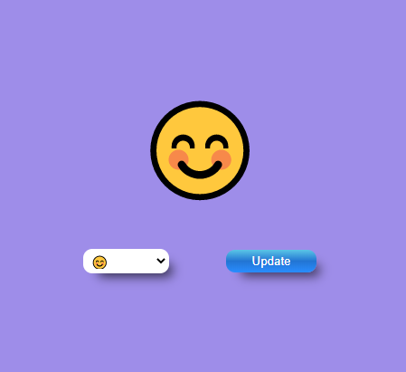
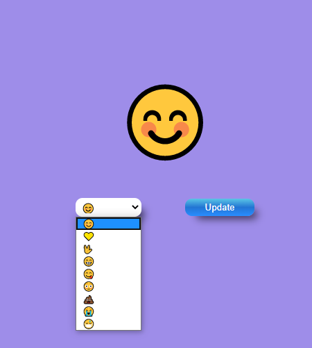
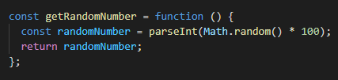

# Smile... or not

## Sonríe… o no (empezando con JS)

Nos han encargado una pequeña aplicación web donde podremos mostrar si tenemos un buen día o si es mejor no pasarse hoy por nuestra mesa. 

Disponemos de toda la ventana del navegador para pintar una carita con un fondo. 

En la parte baja de la pantalla tenemos un select donde podremos elegir varios estados de aánimo, y un botón de actualizar.

Por defecto vamos de buenas y se mostramos la carita sonriente sobre un fondo de color morado.

Con el **select** podremos cambiar nuestro estado de ánimo.

El boton **Update** hace varias cosas:
- Recoge el nuevo estado del select y lo pinta en el lugar del actual.
- Genera un número aleatorio, de 100 como máximo, y si es un número par colocará el color de fondo del morado y si es impar, verde.

¿Cómo va lo del **número aleatorio**?
JavaScriot tiene sus formas de crear números aleatorios.

Gracias a la guía MDN vemos que existe la función Math.random() que nos retorna un punto flotante, un número pseudo-aleatorio dentro del rango [0, 1). 

Esto es, desde el 0 (Incluido) hasta el 1 pero sin incluirlo (excluido).

Nosotros hemos creado una función en la que le indicamos los parámetros para tener en cuenta el número máximo 100:

